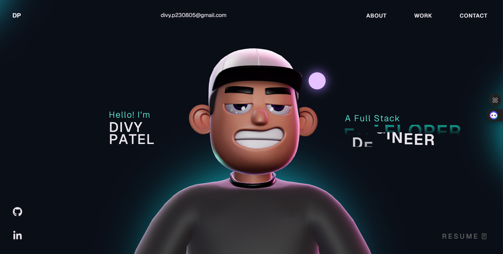

# Divy Patel Portfolio

This repository contains the source code for Divy Patel's personal portfolio website. It is a Vite-based React and TypeScript project featuring animated sections, project highlights, a 3D character experience, and a contact section for showcasing work and skills.

## Features

- Responsive personal portfolio layout
- Animated landing and scroll-driven interactions with GSAP
- 3D character experience built with Three.js
- Dedicated sections for About, Work, Tech Stack, Career, and Contact
- Ready for deployment on Vercel

## Tech Stack

- React
- TypeScript
- Vite
- GSAP
- Three.js
- HTML
- CSS

## Getting Started

1. Install dependencies:

```bash
npm install
```

2. Start the development server:

```bash
npm run dev
```

3. Build for production:

```bash
npm run build
```

4. Preview the production build locally:

```bash
npm run preview
```

## Notes

- The project uses `gsap-trial`. If you plan to use Club GSAP plugins in production, make sure your setup and licensing match GSAP's hosting requirements.
- The 3D assets under `public/models/` are part of the portfolio experience and should be included when deploying.

## Preview



## License

This project is available under the [MIT License](LICENSE).
